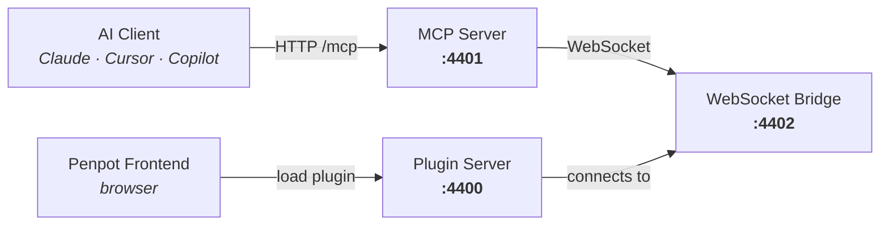

# Penpot MCP Server — Docker


Dockerized build of the official [@penpot/mcp](https://www.npmjs.com/package/@penpot/mcp) npm package. Run the Penpot MCP server and plugin server in a single container — designed to integrate directly into your self-hosted Penpot Docker stack.

## What It Does

The Penpot MCP server exposes [Model Context Protocol](https://modelcontextprotocol.io/) endpoints that let AI assistants (Claude, Cursor, Copilot, etc.) interact with Penpot design files. It provides tools for:

- **`execute_code`** — Run Penpot Plugin API code in the browser context
- **`high_level_overview`** — Get a summary of the current Penpot project
- **`penpot_api_info`** — Query the Penpot Plugin API documentation
- **`export_shape`** — Export shapes/components as images
- **`import_image`** — Import images into Penpot projects

The container runs **two servers**:
1. **MCP Server** — handles AI client connections (HTTP/SSE + WebSocket)
2. **Plugin Server** — serves the MCP plugin to Penpot (`manifest.json`)

## How It Works



**Flow:**
1. Penpot frontend loads the MCP plugin from the **Plugin Server** (port 4400)
2. The plugin connects to the **WebSocket Bridge** (port 4402)
3. Your **AI client** connects to the **MCP Server** (port 4401)
4. When the AI needs to interact with your design, it sends an MCP request → the server forwards it to the plugin → the plugin executes in Penpot and returns the result

## Ports

| Port | Protocol | Purpose |
|------|----------|---------|
| 4400 | HTTP | Plugin server (`/manifest.json`) — loaded by Penpot frontend |
| 4401 | HTTP/SSE | MCP client connections (`/mcp` streamable HTTP, `/sse` legacy) |
| 4402 | WebSocket | Penpot plugin bridge |
| 4403 | TCP/HTTP | REPL interface for debugging |

## Quick Start

```bash
# Clone this repo
git clone https://github.com/sebathi/penpot-mcp-docker.git
cd penpot-mcp-docker

# Copy env defaults
cp .env.example .env

# Build and run
docker compose up -d

# Verify
docker logs penpot-mcp-server
```

The MCP server will be available at `http://localhost:4401/mcp` and the plugin at `http://localhost:4400/manifest.json`.

## Integrating with Self-Hosted Penpot

Add the MCP service to your existing Penpot `docker-compose.yml`:

```yaml
services:
  # ... your existing penpot services (frontend, backend, exporter, etc.)

  penpot-mcp:
    image: sebathi/penpot-mcp-docker:latest
    # Or build from source:
    # build:
    #   context: ./penpot-mcp-docker
    container_name: penpot-mcp
    ports:
      - "4400:4400"  # Plugin server
      - "4401:4401"  # MCP server
      - "4402:4402"  # WebSocket bridge
      - "4403:4403"  # REPL (optional)
    environment:
      - PENPOT_MCP_SERVER_LISTEN_ADDRESS=0.0.0.0
      - PENPOT_MCP_SERVER_ADDRESS=penpot-mcp  # Use container name on shared network
      - PENPOT_MCP_PLUGIN_SERVER_HOST=0.0.0.0
    restart: unless-stopped
    networks:
      - penpot  # Must be on the same network as penpot-frontend
```

Then in Penpot, load the plugin from:
```
http://penpot-mcp:4400/manifest.json
```

> **Note:** If Penpot frontend is served over HTTPS, Chromium-based browsers may block the connection to the HTTP plugin server. Use Firefox or configure your reverse proxy to serve the plugin over HTTPS as well.

### Using with a Reverse Proxy

If you run Penpot behind a reverse proxy (nginx, traefik, caddy), add routes for the MCP services:

```nginx
# nginx example
location /mcp-plugin/ {
    proxy_pass http://penpot-mcp:4400/;
    proxy_http_version 1.1;
    proxy_set_header Upgrade $http_upgrade;
    proxy_set_header Connection "upgrade";
}

location /mcp/ {
    proxy_pass http://penpot-mcp:4401/;
    proxy_http_version 1.1;
    proxy_set_header Upgrade $http_upgrade;
    proxy_set_header Connection "upgrade";
}
```

Then load the plugin from `https://your-domain/mcp-plugin/manifest.json` and connect your AI client to `https://your-domain/mcp/`.

## Configuration

All configuration is via environment variables. Copy `.env.example` to `.env` and adjust as needed.

### Server Binding

| Variable | Default | Description |
|----------|---------|-------------|
| `PENPOT_MCP_SERVER_LISTEN_ADDRESS` | `0.0.0.0` | Address the MCP server binds to |
| `PENPOT_MCP_SERVER_ADDRESS` | `localhost` | Hostname clients use to reach the server (used by plugin to construct WebSocket URL) |
| `PENPOT_MCP_SERVER_PORT` | `4401` | HTTP/SSE port |
| `PENPOT_MCP_WEBSOCKET_PORT` | `4402` | WebSocket port for plugin bridge |
| `PENPOT_MCP_REPL_PORT` | `4403` | REPL debugging port |

### Plugin Server

| Variable | Default | Description |
|----------|---------|-------------|
| `PENPOT_MCP_PLUGIN_SERVER_PORT` | `4400` | Plugin server port |
| `PENPOT_MCP_PLUGIN_SERVER_HOST` | `0.0.0.0` | Address the plugin server binds to |

### Logging

| Variable | Default | Description |
|----------|---------|-------------|
| `PENPOT_MCP_LOG_LEVEL` | `info` | Log level: `trace`, `debug`, `info`, `warn`, `error`, `fatal` |
| `PENPOT_MCP_LOG_DIR` | `/app/logs` | Directory for log files (mapped to a Docker volume) |

### Runtime Modes

| Variable | Default | Description |
|----------|---------|-------------|
| `PENPOT_MCP_REMOTE_MODE` | `false` | Disable local filesystem access |
| `MULTI_USER` | `false` | Enable multi-user mode (also enables remote mode) |

## Multi-User Mode

Multi-user mode allows multiple clients to connect simultaneously, each with their own session. It also enables remote mode automatically.

```bash
MULTI_USER=true docker compose up -d
```

> **Warning:** Multi-user mode is under development and not yet fully integrated. Tools that read from or write to the local file system (import/export) are not supported in this mode.

## MCP Client Configuration

### Step 1 — Start the server

```bash
docker compose up -d
```

### Step 2 — Connect the Penpot plugin

1. Open Penpot in your browser and navigate to a design file
2. Go to **Plugins → Load from URL**
3. Enter: `http://localhost:4400/manifest.json`
4. Open the plugin UI and click **Connect to MCP server**
5. Keep the plugin window open while working with AI agents

### Step 3 — Configure your MCP client

**Claude Desktop** — add to `claude_desktop_config.json`:

```json
{
  "mcpServers": {
    "penpot": {
      "url": "http://localhost:4401/mcp"
    }
  }
}
```

**Claude Code:**

```bash
claude mcp add penpot --transport http http://localhost:4401/mcp
```

**Cursor** — add to `.cursor/mcp.json`:

```json
{
  "mcpServers": {
    "penpot": {
      "url": "http://localhost:4401/mcp"
    }
  }
}
```

**VS Code / Copilot:**

```json
{
  "mcpServers": {
    "penpot": {
      "transport": "http",
      "url": "http://localhost:4401/mcp"
    }
  }
}
```

### Legacy SSE clients

For clients that don't support Streamable HTTP, use the SSE endpoint:

```json
{
  "mcpServers": {
    "penpot": {
      "url": "http://localhost:4401/sse"
    }
  }
}
```

### Using stdio transport (proxy)

For clients that only support stdio, use `mcp-remote` as a proxy:

```bash
npx -y mcp-remote http://localhost:4401/mcp --allow-http
```

## Architecture

The Docker image is built in two stages:

1. **Builder** (`node:22-slim`) — Installs `@penpot/mcp` from npm, restores the pnpm lockfile, installs all workspace dependencies, and builds all packages (common types, server, plugin).

2. **Runtime** (`node:22-slim`) — Copies the built package from the builder stage, runs as a non-root `penpot` user (UID 1001), and starts both the MCP server and plugin server via the entrypoint script.

This approach avoids cloning the full Penpot repository and builds directly from the published npm package, resulting in faster builds and easier version updates.

## Health Check

The container includes a built-in health check that verifies the MCP HTTP server is responding:

```bash
docker inspect --format='{{.State.Health.Status}}' penpot-mcp-server
```

## Logs

Logs are written to a named Docker volume (`penpot-mcp-logs`) and also streamed to stdout:

```bash
# Live logs
docker logs -f penpot-mcp-server

# Log files on the volume
docker run --rm -v penpot-mcp_penpot-mcp-logs:/logs alpine ls /logs
```

## Troubleshooting

**Plugin won't load in Penpot**

- Verify the plugin server is running: `curl http://localhost:4400/manifest.json`
- Chromium browsers may block HTTP connections from HTTPS Penpot instances. Use Firefox or serve the plugin over HTTPS via a reverse proxy.

**MCP client can't connect**

- Verify the MCP server is running: `curl http://localhost:4401/mcp`
- Check container logs: `docker logs penpot-mcp-server`
- Ensure ports are not blocked by firewall

**Plugin shows "Not connected"**

- Make sure the WebSocket port (4402) is accessible
- Check that `PENPOT_MCP_SERVER_ADDRESS` matches what the plugin can reach
- Keep the plugin window open — closing it disconnects the WebSocket

## License

This project packages the official Penpot MCP server. Penpot is licensed under the [MPL-2.0](https://github.com/penpot/penpot/blob/develop/LICENSE).
